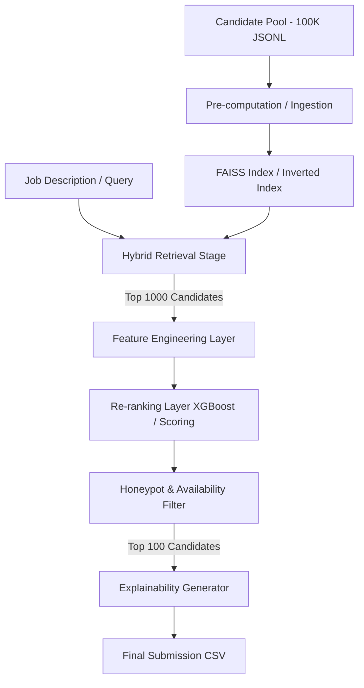

# Candidate Discovery Engine - System Design Document

This document outlines the architecture, data flow, feature engineering, ranking models, and explainability framework for the Redrob Intelligent Candidate Discovery Engine.

---

## 1. System Architecture

The candidate matching and ranking pipeline is designed as a two-stage retrieval and ranking system to meet the execution limits (CPU only, under 5 minutes latency for 100,000 records).

---

## 2. Phase 5: Candidate Discovery & Ranking Strategy

### Stage 1: Semantic Retrieval Strategy
*   **Vectorization**: Candidate profiles (combining `headline`, `summary`, and `current_title`) are vectorized using a compact local sentence transformer model (e.g. `all-MiniLM-L6-v2`) to produce dense vector representations.
*   **Indexing**: Vector similarity search is handled via a CPU-based **FAISS (L2 or Inner Product)** index. This index is pre-computed during development to satisfy the 5-minute runtime constraint.
*   **Hybrid Search**: Dense semantic search is combined with a keyword-based sparse search (BM25 or skill intersections) to handle exact technology matches (like "FastAPI", "XGBoost") alongside conceptual alignment.

### Stage 2: Feature Engineering Strategy
For the top 1,000 candidates retrieved in Stage 1, we compute a set of engineered features:
1.  **Semantic Similarity**: Cosine distance of the candidate's summary/history embedding to the job description.
2.  **Skill Match Overlap**: Jaccard similarity score between the job's required skills and the candidate's normalized skills:
    $$\text{Overlap} = \frac{|\text{Job Required Skills} \cap \text{Candidate Skills}|}{|\text{Job Required Skills}|}$$
3.  **Title Alignment Factor**: Direct match and semantic overlap between the job's target title ("Senior AI Engineer") and the candidate's current title or recent titles in career history (this penalizes keyword-stuffed "Marketing Managers").
4.  **Experience Alignment Score**: Penalty score if the candidate's years of experience is outside the target range (5-9 years, with optimal peaks at 6-8 years).
5.  **Reachability and Availability Multiplier**: Composite score representing the candidate's platform activity:
    $$\text{Availability} = \text{open\_to\_work} \times \text{response\_rate} \times \left(1 - \frac{\text{notice\_period\_days}}{180}\right)$$
    Candidates with notice periods > 90 days or extremely low response rates (< 20%) are down-weighted.

### Stage 3: Ranking Strategy (Re-ranking)
*   **Scoring Model**: A lightweight regression/ranking model (like **XGBoost Ranker** or a tuned heuristic linear scoring function) combines the engineered features (semantic score, skill overlap, experience mismatch, availability multiplier) to output a final candidate score.
*   **Deterministic Tie-breaking**: If scores are equal, ties are broken using the candidate's `last_active_date` (most active first), followed by `candidate_id` ascending as specified in the hackathon rules.
*   **Validation Guard**: We explicitly discard any candidates identified as honeypots by the temporal anomaly checker (joined a startup before its founding year) before sorting.

### Stage 4: Explainability Strategy
*   **Reasoning Format**: A 1-2 sentence description explaining the fit. It must reference specific facts (years of experience, matching skills, location/availability) and explicitly acknowledge gaps (e.g. long notice period).
*   **Generative Template**: To avoid generic, repetitive sentences (penalized at Stage 4 review), we use a structured multi-template rule engine:
    *   *Template A (High Match)*: "Senior AI Engineer with {exp} years of experience building {matched_skills} at product companies; strong recent platform activity."
    *   *Template B (Medium Match with Gaps)*: "{title} matching key NLP/ML requirements; note {notice} days notice period but otherwise strong alignment with Pune/Noida hybrid mode."
    *   *Template C (Lower Match/Filler)*: "Adjacent software engineering experience ({exp} years) with interest in ML transition; strong general development background but lacks deep production search experience."
